# Pokedex — Flutter Mobile App

## Project Summary
Pokedex is a mobile app for Pokemon fans to discover Pokemon, view detailed stats and descriptions, and manage their own captured collection. It connects to PokéAPI for live Pokemon data and also uses a custom backend for account, capture, favorites, and trading flows. What makes it stand out is the polished game-like UI, fast live search suggestions, and end-to-end experience from login to collection management.

## My Role
Solo developer — responsible for UI design, API integration, state management, and deployment.

## Tech Stack
- **Framework:** Flutter (Dart SDK constraint: `^3.6.1`)
- **Language:** Dart
- **State Management:** Riverpod (dependency present via `flutter_riverpod`) and StatefulWidget/`setState` in current screen logic
- **HTTP / API:** `http` package (REST API integration)
- **Key Packages:** `http`, `google_fonts`, `flutter_riverpod`, `shared_preferences`, `cupertino_icons`
- **Target Platform:** Android / iOS
- **Architecture Pattern:** MVC-style modular structure (UI in `lib/screens`, reusable helpers/services in `lib/utils`, backend API in `backend/`)

## Unique Features & Specialties
- Real-time Pokemon search with debounced suggestions while typing (`Timer`-based input debounce in search flow)
- Rich detail experience with gradient UI, chip-based type/ability display, and stat progress bars
- Multi-screen app flow with login/register, home dashboard, search, captures, trading, and mini game
- Local persistence with `shared_preferences` for login/session state and username-based personalization
- Backend-connected user features: signup/login, capture storage, favorites, and trading operations
- Loading, empty, and error states across key screens (spinners, empty-state messages, network/server error messages)
- Basic performance optimization through in-memory caching for home Pokemon list freshness
- Custom reusable input component for registration form (`_RegisterInputField`) and highly themed visual design

## Screenshots
> Project screenshots are located in `assets/images/`

<table align="center">
  <tr>
    <td>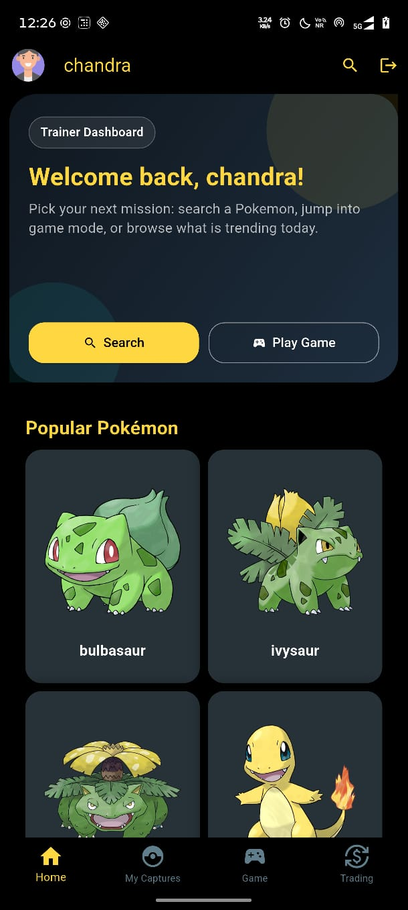</td>
    <td>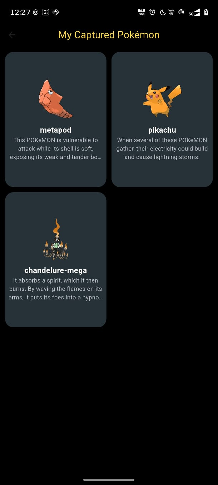</td>
    <td>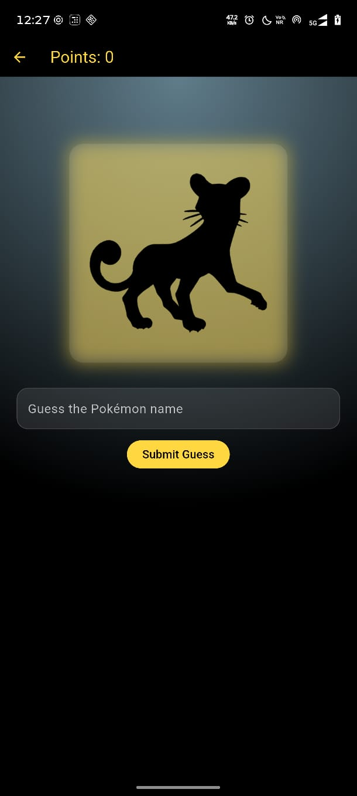</td>
  </tr>
  <tr>
    <td>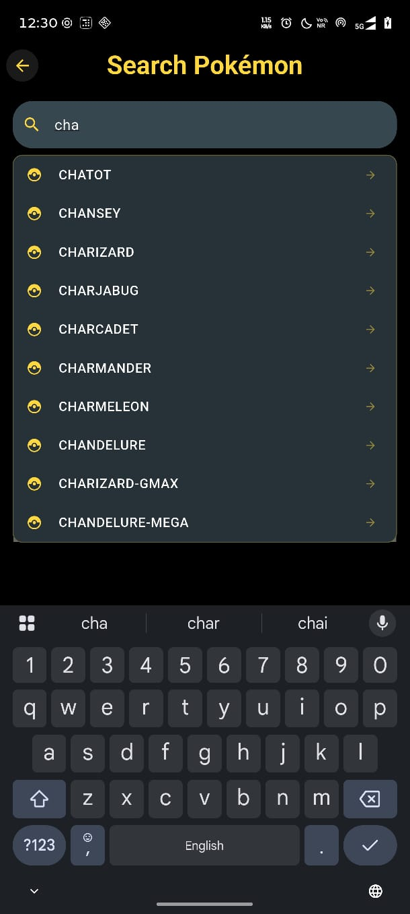</td>
    <td>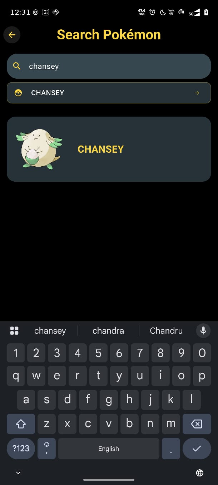</td>
    <td>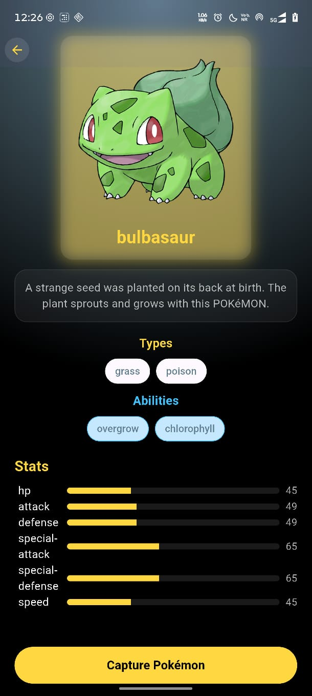</td>
  </tr>
  <tr>
    <td>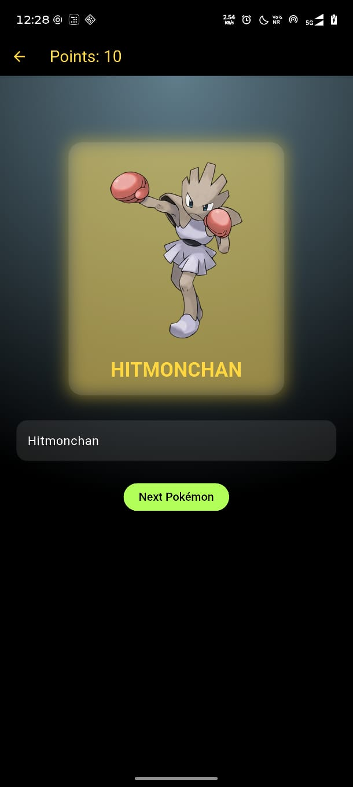</td>
    <td>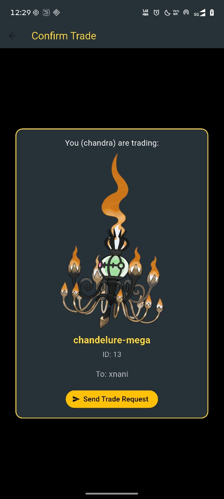</td>
    <td>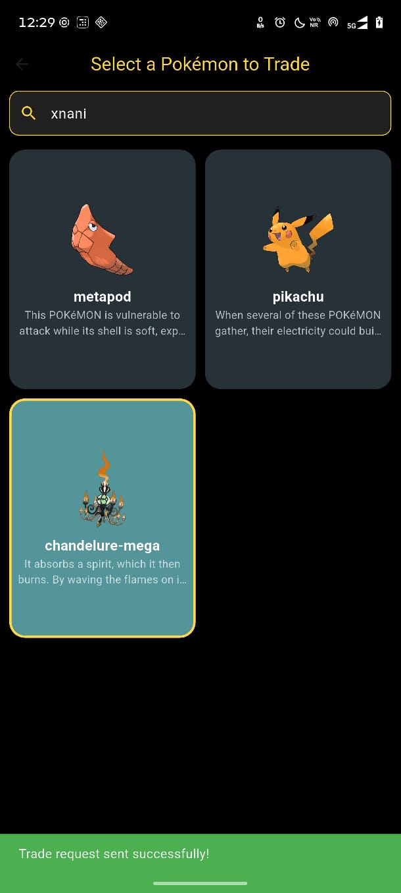</td>
  </tr>
  <tr>
    <td>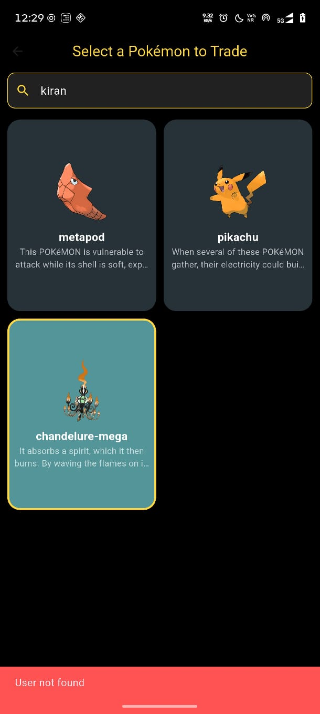</td>
    <td>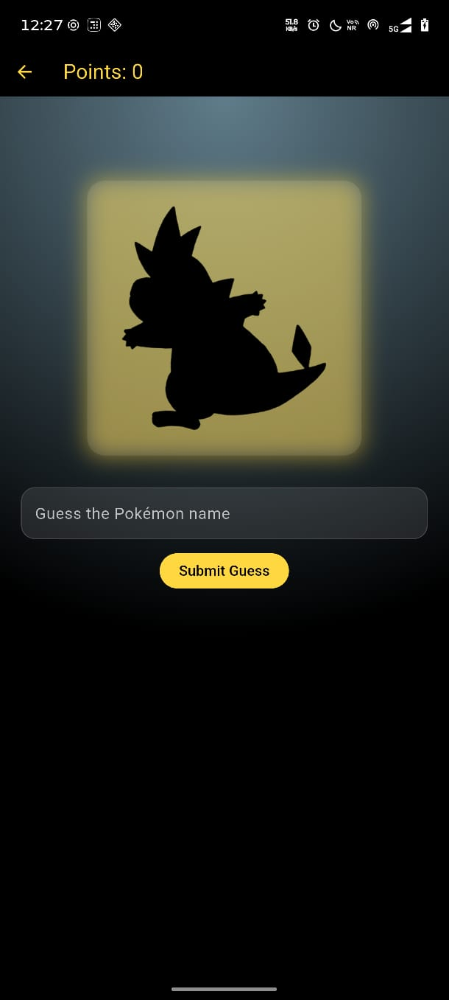</td>

  </tr>
</table>

## Demo Video
> Screen recording is located in `assets/video/`

[Watch Demo](assets/video/vid1.mp4)


## Contra Listing Copy
Pokedex is a feature-rich Flutter app built for users who want a smooth, engaging way to search, explore, and manage Pokemon collections from mobile. I developed the experience end-to-end using Dart and Flutter with REST API integration via `http`, persistent session handling with `shared_preferences`, and a clean modular codebase that is easy to scale. The app includes live search suggestions, polished detail views with dynamic stats UI, and robust user flows for authentication, captures, favorites, and trading. This project demonstrates that I can deliver complete client-ready mobile products that combine strong UI/UX, backend connectivity, and production-minded implementation.

## Skills Tags (for Contra)
Flutter, Dart, Mobile Development, REST API Integration, UI/UX Design, State Management, Android Development

## Folder Structure
Top-level `lib/` structure:

```text
lib/
  main.dart
  screens/
    game_screen.dart
    home_screen.dart
    indipoke_screen.dart
    login_screen.dart
    mycaptures.dart
    mysearch.dart
    practice.dart
    register_screen.dart
    search_screen.dart
    test.dart
    tradconform.dart
    trading_screen.dart
  utils/
    bottom.dart
    capaddfun.dart
    favfun.dart
    scrollable.dart
    usercapfun.dart
    userservice.dart
```
